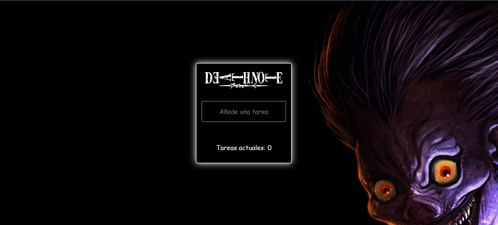
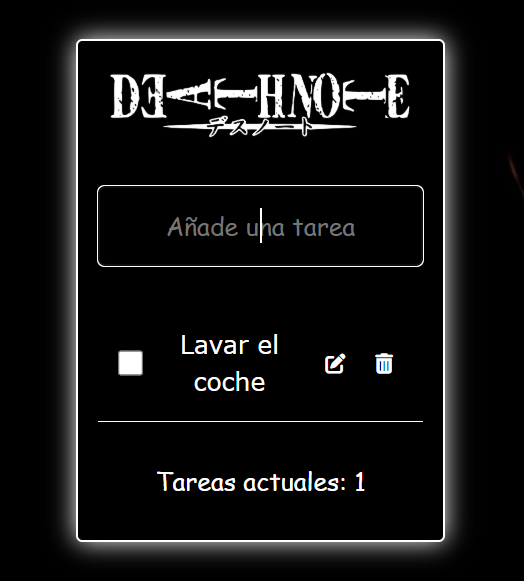
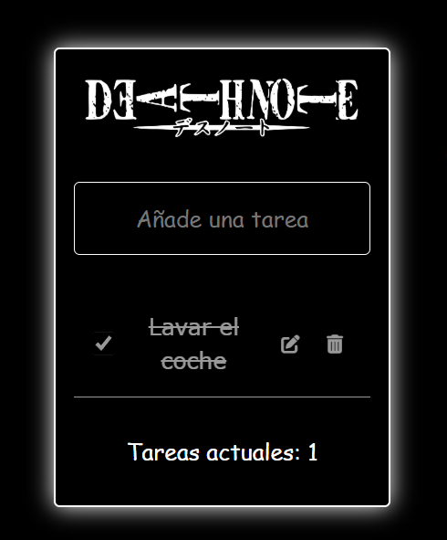
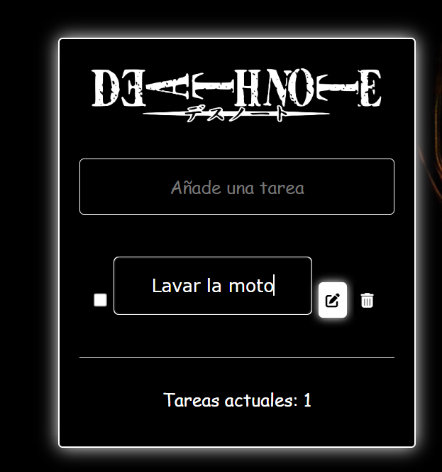

# To-Do List - Versión Death Note

Un elegante To-Do List inspirado en el icónico estilo del anime **Death Note**. Este proyecto permite gestionar tareas con un diseño oscuro y minimalista que refleja la atmósfera del anime.

## Capturas de Pantalla

### Pantalla Inicial


### Añadir Tareas


### Checklist


### Editar Tareas


## Funcionalidades

- **Añadir tareas**: Escribe una nueva tarea y agrégala a la lista.
- **Editar tareas**: Modifica las tareas existentes directamente en la interfaz.
- **Checklist**: Marca las tareas completadas y automáticamente se tachan.
- **Eliminar tareas**: Borra las tareas que ya no necesitas.
- **Estilo único**: Inspirado en el anime *Death Note*, con un diseño oscuro y detalles característicos.

## Tecnologías Utilizadas

- **React**: Para gestionar la interfaz y las funcionalidades dinámicas.
- **CSS**: Para estilizar el diseño y replicar el ambiente de *Death Note*.

## Cómo Ejecutarlo

1. Clona este repositorio en tu máquina local:
   ```bash
   git clone https://github.com/AaronCuadrado/ToDoList-DeathNote.git

2. Navega al directorio del proyecto:
   ```bash
   cd ToDoList-DeathNote

3. Instala las dependencias necesarias:
   ```bash
   npm install

4. Inicia la aplicacion:
   ```bash
   npm start

## Autor

**Aaron Cuadrado Toral**  
Desarrollador Full Stack apasionado por crear proyectos visuales y funcionales.

- **GitHub**: [AaronCuadrado](https://github.com/AaronCuadrado)  
- **LinkedIn**: [Aaron Cuadrado Toral](https://www.linkedin.com/in/aaroncuadrado/)  
